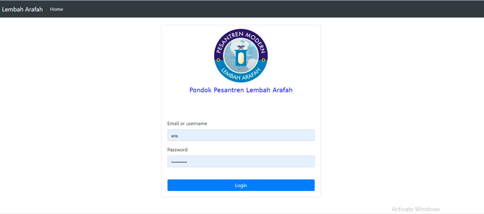
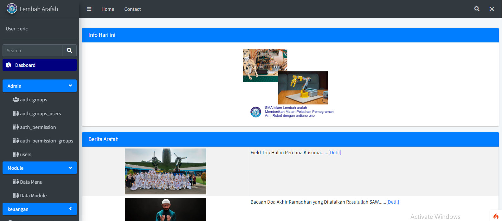
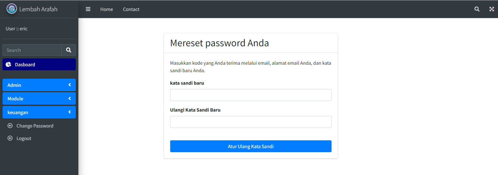
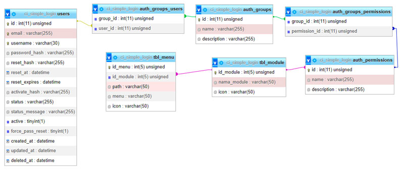

# Simple Login and Management Menu

- FW CodeIgniter 4,

- template AdminLTE,

- Auth sistem Myth/Auth,

- database MySql

#### Screenshot Login



#### Screenshot Menu



#### Screenshot Reset Password



#### Screenshot Relationsip table



## Prerequisites

The following requirements must be met to be able to use the GitHub Actions Importer:

- Apache, Php and MySql Must be installed.
- Install git https://git-scm.com/book/en/v2/Getting-Started-Installing-Git

### Instalation

```bash
git clone https://github.com/eristaufiqhidayat/Simple-Login-CI4.git
```

- create databasename ci_simple_login in ur mysql database IMPORT dummydata.sql in mysql server (phpmyadmin)
- browse from browser http://localhost/SIMPLE-LOGIN-CI4/public/
- login : admin pass : 123

## Contributing

Pull requests are welcome. For major changes, please open an issue first
to discuss what you would like to change.

Please make sure to update tests as appropriate.

## License

[MIT](https://choosealicense.com/licenses/mit/)

"Intinya Bebas dan Gratis"

Eris Taufiq H
